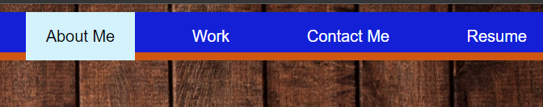
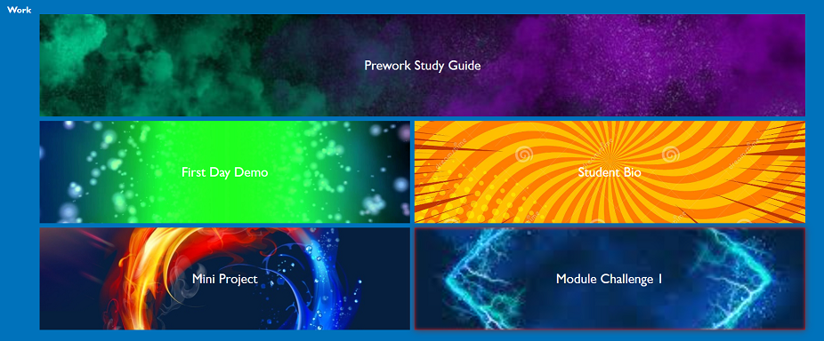
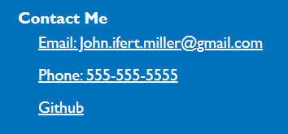
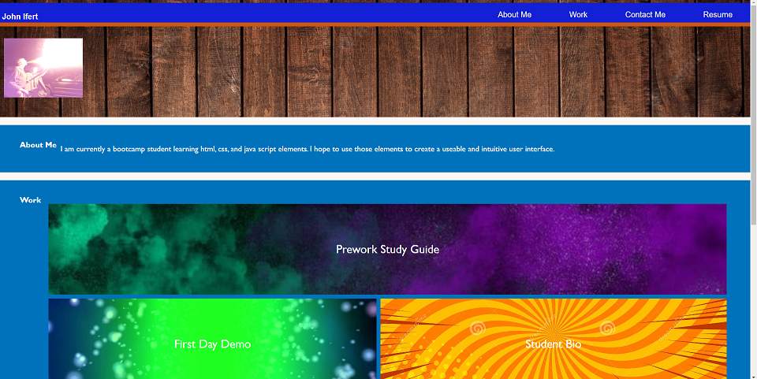

# module2

# Module2challenge

## Description

This project was designed to further my understanding of making a site and creating multiple links to be able to jump to its corresponding information. it was also an exercise in creating a grid format with information that could be used to get to other documents.

## Table of Contents

 - [Installation](#installation)
 - [Usage](#usage)
 - [Credits](#credits)
 - [License](#license)

## Installation

Th use this project the user need to open the index.html in a browser. it can also be reached on github live pages from this link https://johnboy514.github.io/module2/

## Usage

To use this project, the user can use the nav bar at the top of the page to jump to the information blcok that intrests them. each box in the grid will lead to a link of a previous project or class assignment. the user can also access me through email phone or github by clicking on the links at the bottom of the page.

Example images are listed below:

## Credits

Robert Obernier
https://github.com/rjo6615

## License

N/A